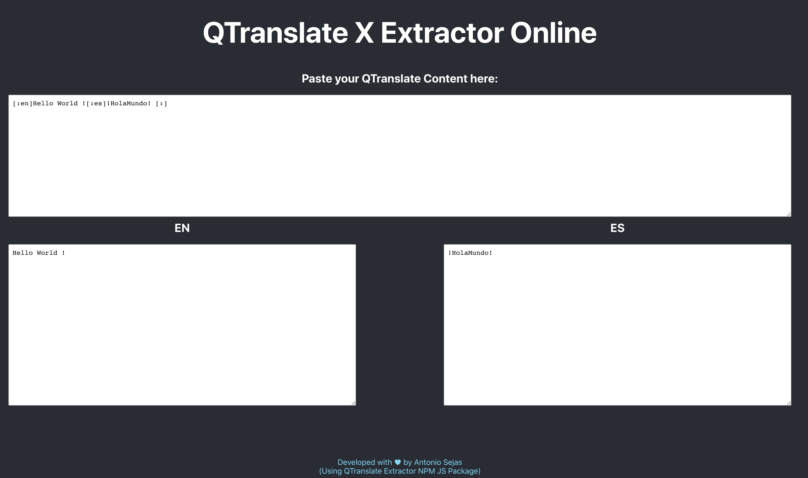

# qtranslatex-online

This is an example of how to use the npm package `qtranslatex-extractor`.

NPM Package available in : [https://www.npmjs.com/package/qtranslatex-extractor](https://www.npmjs.com/package/qtranslatex-extractor)

## Demo

- You can try it live in: [https://sejas.github.io/qtranslatex-online/](https://sejas.github.io/qtranslatex-online/)
  

## How it works?:

Receive the qtranslate string and return an object with each translation.
Use it with NodeJS to automate your process.
Or in your frontend to show your text dinamically.

```ts
import qtranslatexExtractor from "qtranslatex-extractor";

const translations = qtranslatexExtractor(
  "[:en]Hello World ![:es]¡HolaMundo![:]"
);
```

## Commands

- `npm start`
- `npm run build`

## Author

© Antonio Sejas
Feb 2019
MIT License
